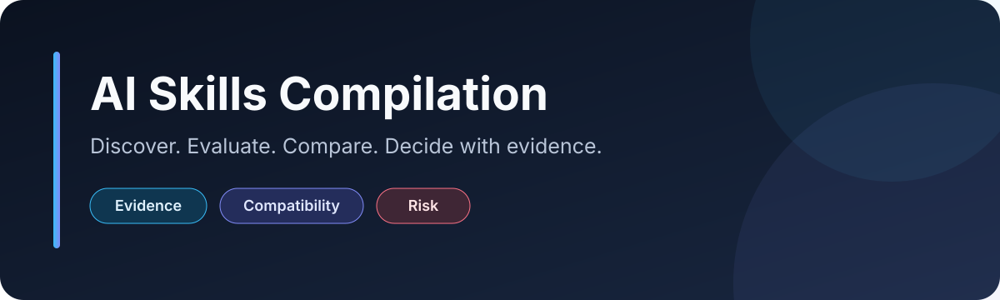

  

  
<strong>An evidence-first catalog for AI skills, agents, MCPs, prompts, frameworks, and tools.</strong>

  
Understand compatibility, permissions, risk, and safe-use boundaries before you install anything.

  
  
  
  
  
  

# AI Skills Compilation

AI tooling is easy to discover and hard to evaluate. This repository turns scattered claims into concise,
comparable review records. It is intentionally smaller than link dumps: quality, evidence, and maintenance matter
more than entry count. **Star the project if you want a neutral, safety-conscious alternative to unreviewed lists.**

> **Safety notice:** Inclusion is not a recommendation of installation, execution, security, quality, or
> suitability for any project. This catalog never installs or runs the projects it reviews.
>
> **Advertencia:** La inclusión de una herramienta en este catálogo no constituye una recomendación de
> instalación, ejecución, seguridad, calidad ni idoneidad para un proyecto concreto.

## Contents

- [Quick start](#quick-start)
- [Featured reviews](#featured-reviews)
- [Explore the catalog](#explore-the-catalog)
- [Why trust this repository?](#why-trust-this-repository)
- [How to read a review](#how-to-read-a-review)
- [Status, risk, and compatibility](#status-risk-and-compatibility)
- [Project philosophy](#project-philosophy)
- [Contribute in under ten minutes](#contribute-in-under-ten-minutes)
- [FAQ](#faq)
- [License and disclaimer](#license-and-disclaimer)

## Quick start

1. Choose a navigation view: [use case](docs/catalog_by_use_case.md), [AI environment](docs/catalog_by_ai.md),
   [category](docs/catalog_by_category.md), or [recent reviews](docs/catalog_recent_reviews.md).
2. Open a profile and check its `status`, `risk_level`, compatibility evidence, data access, and
   `safe_usage_boundary`.
3. Follow the documented `next_action`. A catalog record never authorizes installation or execution.

Looking for the complete compact list? Start with [`skills/registry.yml`](skills/registry.yml).

## Featured Reviews

Featured means **well documented**, not recommended for installation.

| Review | Why it is featured | Status | Risk |
| --- | --- | --- | --- |
| [Headroom](skills/candidates/headroom.yml) | Clear coverage of proxying, stored context, authorization, file changes, and sandbox questions. | `candidate` | `critical` |
| [Claude-Mem](skills/candidates/claude-mem.yml) | Detailed privacy boundary for hooks, persistent memory, local services, and captured activity. | `candidate` | `critical` |
| [Awesome Agent Skills](skills/accepted/voltagent-awesome-agent-skills-index.yml) | Distinguishes approval of a discovery index from trust in its individual entries. | `approved` | `high` |

## Explore the catalog

| View | Best for |
| --- | --- |
| [By use case](docs/catalog_by_use_case.md) | Starting from a concrete problem. |
| [By AI environment](docs/catalog_by_ai.md) | Comparing documented applicability across assistants. |
| [By category](docs/catalog_by_category.md) | Browsing subject areas. |
| [By publisher or company](docs/catalog_by_company.md) | Finding the public account behind each source. |
| [By status](docs/catalog_by_status.md) | Understanding review maturity. |
| [By risk](docs/catalog_by_risk.md) | Starting with the safety boundary. |
| [By content language](docs/catalog_by_language.md) | Finding documentation you can read. |
| [Recent reviews](docs/catalog_recent_reviews.md) | Seeing when evidence was last reviewed. |

## Why trust this repository?

- **No bulk imports.** Indexes are discovery sources, not shortcuts for copying hundreds of links.
- **Every entry has a review record.** A profile records evidence, uncertainty, access, risk, and next action.
- **Risks stay visible.** High-value tools can remain `high` or `critical` risk.
- **Compatibility is conservative.** Similar formats do not justify a `yes`; insufficient evidence becomes
  `unknown`.
- **Limitations are explicit.** Safe-use boundaries say what should not happen yet.
- **Inclusion is not endorsement.** Even `approved` applies only to the narrow scope written in the profile.

The catalog is validated offline for schema consistency, duplicates, orphaned records, internal links, Markdown
structure, generated navigation, and common secret patterns.

## How to read a review

You should be able to answer these questions in under a minute:

| Profile section | Question answered |
| --- | --- |
| `summary` and `what_it_does` | What is it, and when is it useful? |
| `compatibility` | Which AI environments have documented support? |
| `risk_level` and `risk_reasons` | What can go wrong or needs closer inspection? |
| `data_access` | Can it read, write, persist, execute, or use credentials? |
| Permission flags | Is installation, execution, sandbox testing, or integration allowed? |
| `review` | When was it reviewed and which evidence was checked? |
| `safe_usage_boundary` | What is the narrow safe use, if any? |
| `next_action` | What should happen before the decision changes? |

## Status, risk, and compatibility

### Status

| Value | Meaning |
| --- | --- |
| `candidate` | New or partially reviewed; not cleared for use. |
| `watchlist` | Worth monitoring or reading, but not currently recommended. |
| `approved` | Accepted only for a narrow documented scope; not a safety guarantee. |
| `rejected` | Unsuitable as an active source or for the reviewed use case. |

### Risk

| Value | Meaning |
| --- | --- |
| `low` | Documentation or prompts only; no execution or persistent access identified. |
| `medium` | May read or write non-code files, persist context, use networks, or modify assistant behavior. |
| `high` | Can execute commands, modify code or sensitive configuration, install packages, control browsers, or automate commits. |
| `critical` | May handle credentials, remote systems, destructive actions, or hidden persistence. |

See the evidence rules in the [risk matrix](docs/risk_matrix.md).

### Compatibility

| Value | Meaning |
| --- | --- |
| `yes` | Direct support is documented by primary evidence. |
| `limited` | Ideas or instructions may transfer with adaptation. |
| `no` | Not appropriate for that environment. |
| `unknown` | Evidence is insufficient. |

Compatibility is about documented applicability—not quality, safety, or permission to use. See the
[compatibility model](docs/compatibility_model.md).

## Project philosophy

1. Evidence before claims.
2. Quality before quantity.
3. Primary sources before commentary.
4. Explicit uncertainty before optimistic compatibility.
5. Human review before installation or execution.
6. A small, maintained catalog before a large, stale one.

Read [why this exists](WHY_THIS_EXISTS.md) and the [project vision](PROJECT_VISION.md) for the long-term direction.

## Contribute in under ten minutes

The fastest path is the
[Repository Suggestion form](https://github.com/AcTweeteR/AI-Skills-Compilation/issues/new?template=repository_suggestion.yml).
Provide one public primary source, the resource type, a concrete use case, and known risks. Maintainers will screen
duplicates and decide whether a full candidate review is warranted.

To submit a complete review, copy [`skills/profile-template.yml`](skills/profile-template.yml), follow the
[worked example](docs/examples/candidate-profile.yml), and use the [contribution guide](CONTRIBUTING.md). The pull
request checklist prevents missing evidence or accidental secrets.

## FAQ

<strong>Does “approved” mean safe to install?</strong>

No. Approval applies only to the profile's documented scope. Several approved entries are safe only as read-only
discovery sources.

<strong>Why is the catalog small?</strong>

Each entry carries maintenance cost. The project adds records only when they contribute distinct, reviewable value.

<strong>Can I suggest my own project?</strong>

Yes. Disclose your relationship, provide primary documentation, and expect the same evidence and risk standards as
every other submission.

<strong>Why can a useful tool have critical risk?</strong>

Utility and risk are separate. A tool that handles credentials, intercepts agent traffic, or persists sensitive
context can be useful and still require strict isolation.

<strong>Does CI check external projects?</strong>

No. CI stays offline and never downloads or executes cataloged software. External availability and behavior require
separate human review.

## License and disclaimer

Repository content is available under the [MIT License](LICENSE). External projects remain the property of their
authors and may use different licenses. Read the full [disclaimer](DISCLAIMER.md), [security policy](SECURITY.md),
and [code of conduct](CODE_OF_CONDUCT.md) before contributing or relying on a review.
